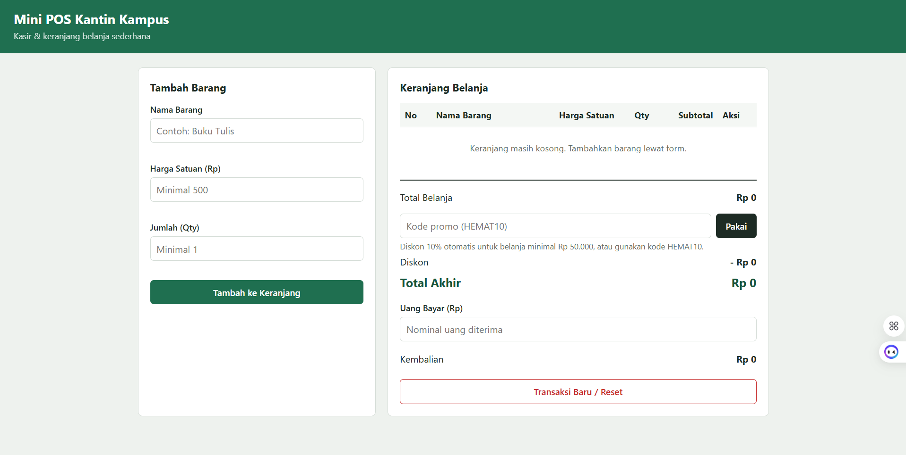
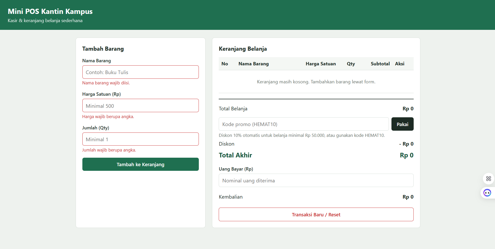
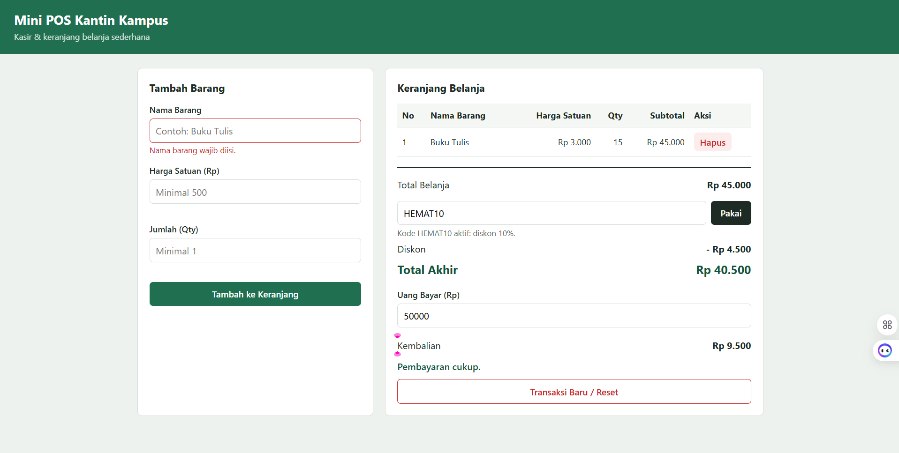

# Mini POS Kantin Kampus

## Identitas
- **Nama Lengkap:** Najib Abhinaya
- **NIM:** 124140124
- **Kelas Praktikum:** RB

## Deskripsi Aplikasi
Mini POS adalah aplikasi web kasir dan keranjang belanja sederhana untuk kantin atau toko kampus. Tujuannya melatih tiga kompetensi dasar: validasi input form, perhitungan kalkulator otomatis, dan penyimpanan data dengan `localStorage`. Studi kasus yang dipilih adalah kasir kantin: kasir memasukkan barang, sistem menghitung total, diskon, dan kembalian.

## Panduan Menjalankan
1. Clone atau unduh repository ini.
2. Buka folder `najibabhinaya_124140124_pertemuan1` di VS Code.
3. Install ekstensi **Live Server**.
4. Klik kanan `index.html`, pilih **Open with Live Server**.
5. Aplikasi terbuka di browser (alamat biasanya `http://127.0.0.1:5500`). Alternatif: klik dua kali `index.html`.

## Daftar Fitur
- [x] Validasi nama barang (wajib, minimal 3 karakter)
- [x] Validasi harga satuan (angka, minimal Rp 500)
- [x] Validasi qty (bilangan bulat, minimal 1)
- [x] Pesan error merah di bawah input dan form di-reset otomatis jika berhasil
- [x] Subtotal otomatis per baris (harga x qty)
- [x] Total belanja otomatis
- [x] Diskon 10% untuk belanja minimal Rp 50.000 atau kode promo `HEMAT10`
- [x] Kalkulator uang bayar dan kembalian, dengan pesan jika uang kurang
- [x] Tabel keranjang (No, Nama Barang, Harga Satuan, Qty, Subtotal, Aksi)
- [x] Hapus item dengan perhitungan ulang otomatis
- [x] Penyimpanan keranjang ke `localStorage` (tetap ada setelah refresh)
- [x] Tombol Transaksi Baru / Reset

## Tangkapan Layar
| Form input utama | Validasi error | Hasil perhitungan dan tabel |
|---|---|---|
|  |  |  |

## Penjelasan Teknis Singkat
**Validasi input.** Setiap input punya fungsi validasi sendiri yang mengembalikan `true` atau `false` dan menampilkan pesan merah di bawah input. Saat form di-submit, `preventDefault()` mencegah reload, lalu ketiga validasi dijalankan. Barang hanya masuk keranjang jika semuanya valid.

**Algoritma kalkulator.** Subtotal = harga x qty. Total belanja dihitung dengan `reduce()` atas seluruh item. Diskon 10% diberikan jika total >= 50.000 atau kode `HEMAT10` aktif. Total akhir = total - diskon, dan kembalian = uang bayar - total akhir. Jika uang bayar kurang dari total akhir, ditampilkan pesan bahwa uang belum mencukupi.

**Mekanisme localStorage.** Array `keranjang` diubah menjadi teks dengan `JSON.stringify()` lalu disimpan lewat `localStorage.setItem()`. Saat halaman dibuka, data dibaca dengan `localStorage.getItem()` dan dikembalikan menjadi array dengan `JSON.parse()`. Tombol reset memanggil `localStorage.removeItem()`.
